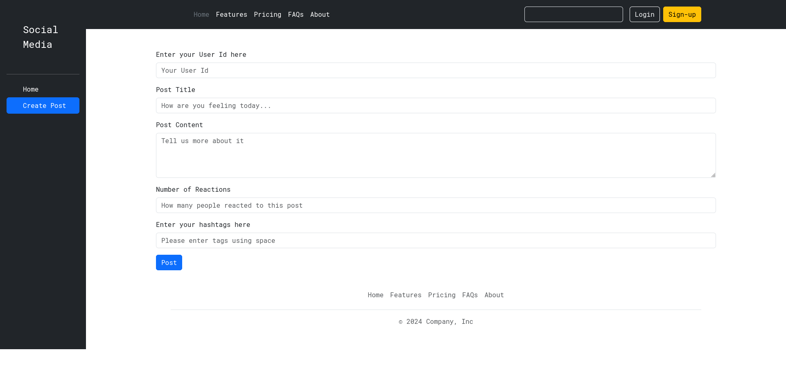

# Social Media App

This is a dynamic frontend social media application built using **React**, **Bootstrap**, **React-icons**, and **Vite**. The app allows users to create posts, view reactions, manage hashtags, and delete posts.

## Features

- **Post Creation**: Users can create posts with a title, content, hashtags, and reactions.
- **Post Deletion**: Users can delete their posts with a single click.
- **Dynamic Updates**: Display posts dynamically with the number of reactions and hashtags.

### Screenshots

#### Home Page

#### Create Post Page

## Tech Stack

- **React**: For building the user interface.
- **Bootstrap**: For responsive design.
- **React-icons**: For adding modern icons.
- **Vite**: As a build tool for faster development.